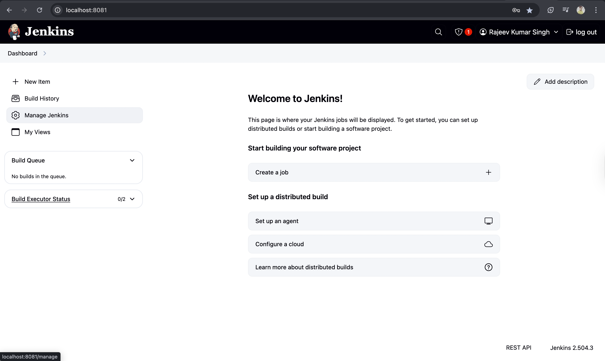

# Today's Task

1. Introduction
2. What is Jenkins
3. Jenkin installation
4. Installing "Stage view" Jenkins plugin

# Jenkins Overview

## What is Jenkins?

- Jenkins is a continuous integration(CI) and continuous developement(CD) tool.
- it's all about automation and making repetitive tasks easier and more consistent.

## Installing Jenkins

- There are various way of installing Jenkins.
  - Download [`Docker Desktop`](https://www.docker.com/products/docker-desktop/)
  -
  -

# Install Jenkins using Docker Compose

This repository contains a Docker Compose configuration for a quick installation of Jenkins. This setup is not intended for production systems.

Credits: This approach is mostly based on the [offical instructions](https://www.jenkins.io/doc/book/installing/docker/) but takes advantage of Docker Compose (by using a `docker-compose.yml` file) to reduce the number of steps needed to get Jenkins up and running.

# Docker Installation

## Step 1

Install Docker locally (probably using Docker Desktop is the easiest approach).

## Step 2

Clone this repository or download it's contents.

## Step 2

Open a terminal window in the same directory where the `Dockerfile` from this repository is located. Build the Jenkins Docker image:

```
docker build -t my-jenkins .
```

## Step 3

Start Jenkins:

```
docker compose up -d
```

## Step 4

Open Jenkins by going to: [http://localhost:8081/](http://localhost:8081/) and finish the installation process.


## Step 5

If you wish to stop Jenkins and get back to it later, run:

```
docker compose down
```

If you wish to start Jenkins again later, just run the same comand from Step 3.

# Removing Jenkins

Once you are done playing with Jenkins maybe it is time to clean things up.

Run the following comand to terminate Jenkins and to remove all volumes and images used:

```
docker compose down --volumes --rmi all
```

---

## Installing "Stage view" Jenkins plugin

### Click on manage Jenkins



### Click on plugins


### Click on available plugins


### Search `stage view`

## 

### Select and click install

### 

### Restart jenkins

## 

-
-
-

# Important Links

- [`Jenkins Download and Documentation`](https://www.jenkins.io/)
