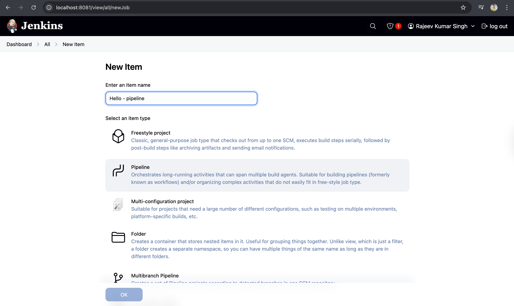

# Day-03: Tasks

1. Create first job

### step 1: Click on `create a job` and next time you have to click on `new item`.

### Step 2:

### Step 3:

- A freestyle job is a job that can be configured through this interface.
  
  and here in Jenkins, there are different kind of options that you can configure, and you can essentially click yourself through creating this job.
- Now essentially, in essence, a job is supposed to run a command.
- So what are we going to do here?
  We're going to either scroll down or use the menu here on the left hand side to go to Build Steps.
- And we're going to go ahead and add a build step.
  Now, what do you want to do here is we want to execute shell.
  
- So shell is essentially an interface where we can write commands. I'm going to select here execute shell. And what is the command that we want to use.So for example we can use the command `echo`. And right here echo and between quotes I'm going to write here hello from Jenkins.
  
- Now with this one, let's go ahead and save this configuration and run this job to see what happens.
- And you will see here that the initial screen has disappeared. So now we are getting here on the main page a list of jobs that we can execute.
  So we're going to go here again to hello, going back to the job. And in order to actually run the command that we have written to run this job, we need to click here on Build Now.
  
  
  
- So what is the console output. The console output is essentially where Jenkins writes everything that has happened. So it's keeping notes of what it is doing during the job and it's writing it here. So it's telling us a few things, but what we are actually interested in is here, this part.
  
- We have used the command echo to display this text. And then one line below you can actually see the text that we have executed. So this is, in a nutshell, the most simple job that you can create in Jenkins.

---

### Create another job called pipeline

- So every time you want to go back to the start page, we need to click here on top on dashboard.
  This is how you come back to this overview of all the jobs that you have. And I'm going to go here and click on New Item. And I'm going to write here **Hello - pipeline**
  
  
- So in this pipeline we have this syntax.
- Pipeline has different stages and everything is wrapped between this curly braces.
- And we have here a `stage`. Hello,
  And we are using echo to display a message.
  So it's essentially pretty much the same thing as we did before with just writing that command.
  But now we're using this pipeline syntax.
  That's the main difference. So I'm going to go ahead and save this. And run it with build now.
  
  
- Using shell command in pipeline job
  
  

---

## What exactly is a pipeline?

Now, pipeline, as you have seen a bit in the configuration, is essentially a set of stages.
Or you can also call them jobs. So we only have one stage here. But typically a pipeline has multiple stages. Now right now we only have the simple stage. But we're gonna be adding multiple stages to this pipeline and then it will start making more sense.

---

# Jenkins Architecture

## What is realy happening when you run this Jenkins job?

- At a minimum, the Jenkins architecture contains the `Jenkins server`, which is also called a `controller`, and a `Jenkins agent`, sometimes also called a `node`. The `Jenkins controller` manages the execution of the pipeline and saves the results. The controller knows what needs to be done, but does not do it itself. When a `stage` needs to be executed, it will find a `Jenkins agent` to actually run the job. It is like in the James Bond movies.

> Continue tommorrow from here. It's enough for now
