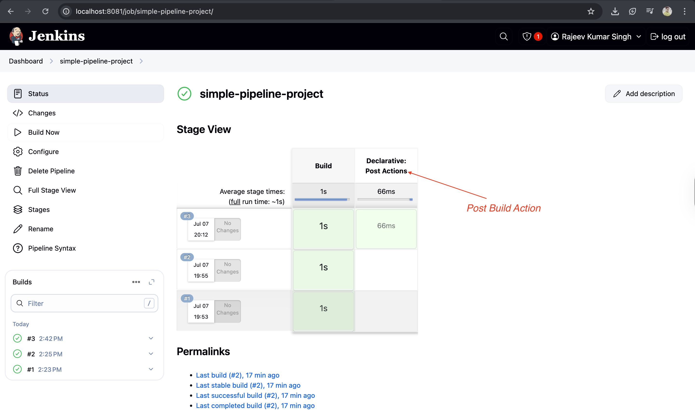

# Day-05: Tasks

1. Jenkins workspace

### Check jenkins_worspace_explained.md

2. Post Build Action

```json
pipeline {
    agent any

    stages {
        stage('Build') {
            steps {
                echo 'Building simple pipeline project for you..!'
                sh "mkdir -p build"
                sh "touch build/computer.txt"
                sh "echo 'Mainboard' >> build/computer.txt"
                sh  "cat build/computer.txt"
            }
        }
    }
    post{
        always{
            cleanWs()
        }
    }
}

```


