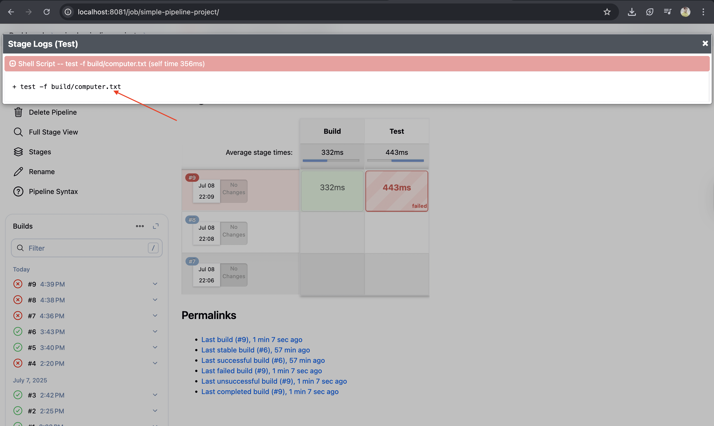
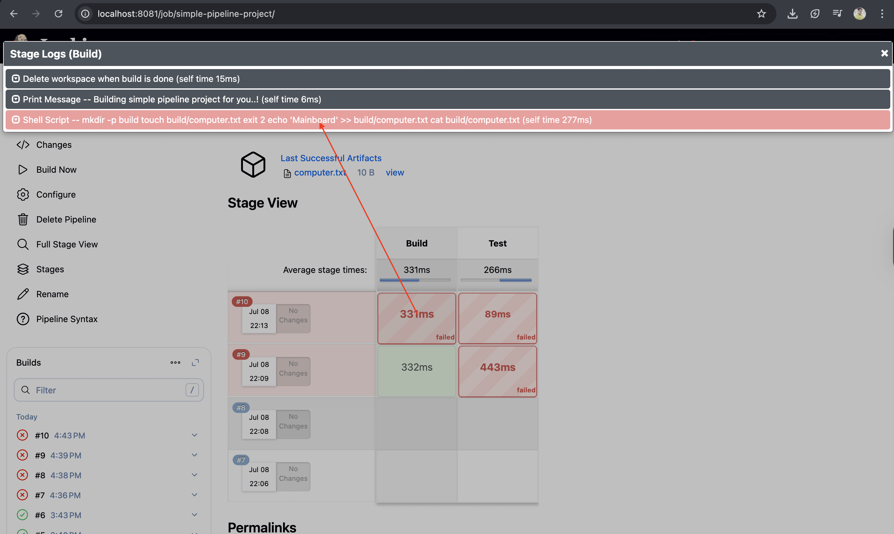
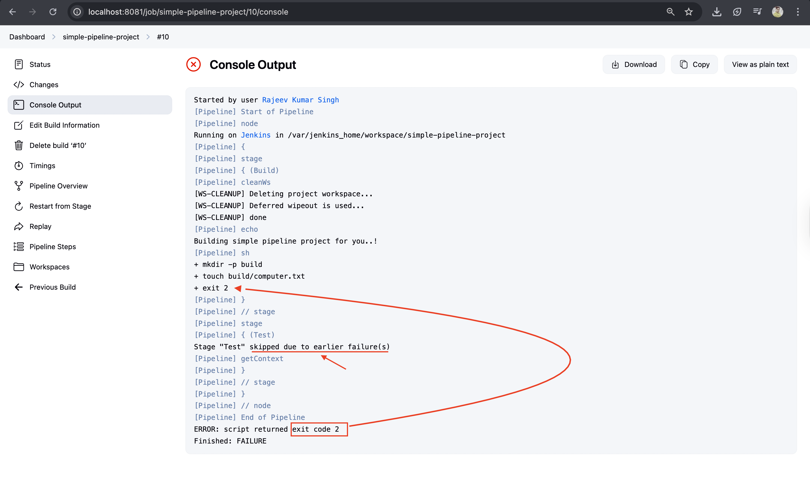

# Day-06: Tasks

1. Storing build artifact in Jenkins
2. Manually interupting the pipeline execution
3. combining multiple shell steps(sh) into one
4. Pipeline stages
5. Why do pipeline fail? Exit code explained.

---

## Exit code

- Now, exit codes are a way to communicate if the execution of a program has been successful or not.
- An exit code `zero` will indicate that the program has been executed successfully.
- Any other exit code, which can be a number from `1` to `255`, indicates failure.
- So if one command fails, if one command tells exit code one or any other exit code that is not zero, then Jenkins will essentially stop the execution. It will fail the pipeline, so the entire pipeline will be marked as `failed`.

```json
pipeline {
    agent any

    stages {
        stage('Build') {
            steps {
                cleanWs()
                echo 'Building simple pipeline project for you..!'
                sh'''
                  mkdir -p build
                  touch build/computer.txt
                  echo 'Mainboard' >> build/computer.txt
                  cat build/computer.txt
                  rm build/computer.txt
                '''
            }
        }
        stage('Test'){
          steps{
            sh "test -f build/computer.txt"
          }
        }
    }

    post{
        success{
            archiveArtifacts artifacts: 'build/**'
        }

    }
}

```

`O/P`


---

```json
pipeline {
    agent any

    stages {
        stage('Build') {
            steps {
                cleanWs()
                echo 'Building simple pipeline project for you..!'
                sh'''
                  mkdir -p build
                  touch build/computer.txt
                  exit 2
                  echo 'Mainboard' >> build/computer.txt
                  cat build/computer.txt

                '''
            }
        }
        stage('Test'){
          steps{
            sh "test -f build/computer.txt"
          }
        }
    }

    post{
        success{
            archiveArtifacts artifacts: 'build/**'
        }

    }
}

```

`O/P`


