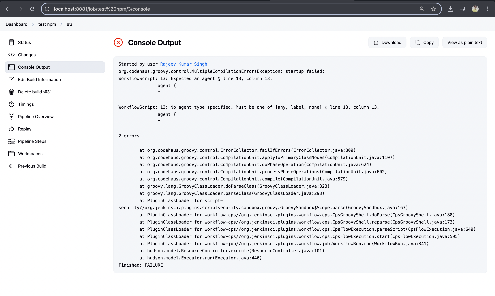
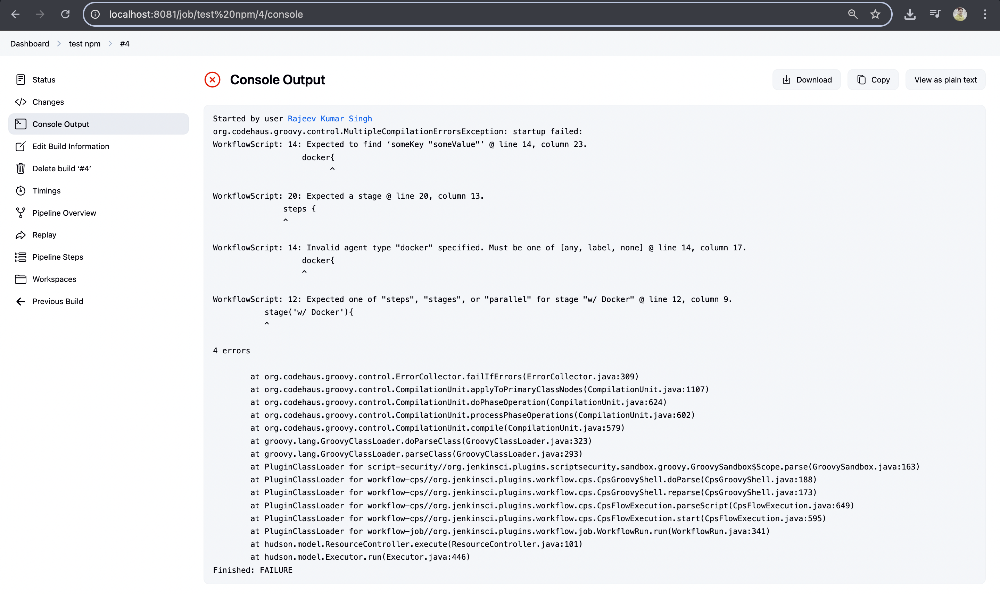

# Day-08: Tasks

1. Using Docker as a build environment
2. Troubleshooting Jenkins while using Docker in Jenkinsfile
3. Workspace synchronization

## Resource Link:

[`Workspace Synchronization`](https://www.jenkins.io/doc/book/pipeline/docker/#workspace-synchronization)

---

1. Using Docker as a build environment

## Check npm is there or not on agent

```Jenkinsfile

pipeline {
    agent any

    stages {
        stage('w/o docker') {
            steps {
                sh 'echo "Without docker"'
            }
        }

        stage('w/ docker') {
            agent {
                docker {
                    image 'node:18-alpine'
                }
            }
            steps {
                sh 'echo "With docker"'
                sh 'npm --version'
            }
        }
    }
}

```


---

So we're running `npm --version`. But we're getting the error **_npm not found_**. So we don't even need a project files. We don't need a `package.json` file. We don't even have `npm` installed to be able to run any of the commands that we did so far in the repository itself. Now this code space is kind of like smarty knows what kind of a project we have, and already creates a special image that has all these tools installed, but Jenkins doesn't know anything about this.

- Now, to solve this in Jenkins, there are two approaches.

1. One approach is to simply go on the agent or on the agent and manually install `npm`, which is a tool that comes when we install Node.js, which is a platform for running JavaScript.
2. The other option is to use `Docker`, which allows us to use Docker containers as needed.

- The disadvantage with the first approach when it comes to installing all these tools directly on the agents is that typically Jenkins is supposed to run multiple projects. Now, when we are using this project, we may need different versions. So for example, maybe this project is working with node 18, but maybe we have a legacy project that is using node ten. Now there are always different workarounds in order to get something like this working, but typically it's not so easy. So we may have conflicting versions of these tools. Now Docker allows us to separate this.
-

```Jenkinsfile

pipeline {
    agent any

    stages {
        stage('w/o Docker') {
            steps {
                sh '''
                  echo "Without Docker"
                '''
            }
        }
        stage('w/ Docker'){
            agent {
                image: node:18-alpine
            }
            steps {
                sh '''
                  echo "With Docker"
                '''
            }
        }
    }
}

```

`Console Output`


---

```
pipeline {
    agent any

    stages {
        stage('w/o Docker') {
            steps {
                sh '''
                  echo "Without Docker"
                '''
            }
        }
        stage('w/ Docker'){
            agent {
                docker{
                    image: node:18-alpine
                }
                }

            }
            steps {
                sh '''
                  echo "With Docker"
                '''
            }
        }
    }


```

## 

- Install `docker pipeline` plugin

```Jenkinsfile
pipeline {
    agent any

    stages {
        stage('w/o docker') {
            steps {
                sh 'echo "Without docker"'
            }
        }

        stage('w/ docker') {
            agent {
                docker {
                    image 'node:18-alpine'
                }
            }
            steps {
                sh 'echo "With docker"'
                sh 'npm --version'
            }
        }
    }
}

```


---

```Jenkinsfile
pipeline {
    agent any

    stages {
        stage('W/O Docker') {
            steps {
                sh 'echo "Without Docker"'

            }
        }
        stage('W/ Docker'){
            agent{
                docker{
                    image 'node:18-alpine'
                }
            }
            steps{
                sh 'echo "With Docker"'
                sh 'npm --version'
            }
        }
    }
}


```

`Build Now`


---

`3-Stages`

```groovy
pipeline {
    agent any

    stages {
        stage('W/O Docker') {
            steps {
                sh 'echo "Without Docker"'
            }
        }

        stage('W/ Docker') {
            agent {
                docker {
                    image 'node:18-alpine'
                }
            }
            steps {
                sh 'echo "With Docker"'
                sh 'npm --version'
            }
        }

        stage('Docker Info Outside Container') {
            steps {
                sh 'docker images'
            }
        }
    }
}

```


---

## 4 stages , run nginx container

```groovy
pipeline {
    agent any

    stages {
        stage('W/O Docker') {
            steps {
                sh 'echo "Without Docker"'
            }
        }

        stage('W/ Docker') {
            agent {
                docker {
                    image 'node:18-alpine'
                }
            }
            steps {
                sh 'echo "With Docker"'
                sh 'npm --version'
            }
        }

        stage('Docker Info Outside Container') {
            steps {
                sh 'docker images'
                sh 'docker ps -a'
            }
        }
        stage('Run container'){
            steps{
                sh 'docker run --name nginx-container nginx'
            }
        }
    }
}

```


```sh
Started by user Rajeev Kumar Singh
[Pipeline] Start of Pipeline
[Pipeline] node
Running on Jenkins in /var/jenkins_home/workspace/test npm
[Pipeline] {
[Pipeline] stage
[Pipeline] { (W/O Docker)
[Pipeline] sh
+ echo Without Docker
Without Docker
[Pipeline] }
[Pipeline] // stage
[Pipeline] stage
[Pipeline] { (W/ Docker)
[Pipeline] node
Running on Jenkins in /var/jenkins_home/workspace/test npm@2
[Pipeline] {
[Pipeline] isUnix
[Pipeline] withEnv
[Pipeline] {
[Pipeline] sh
+ docker inspect -f . node:18-alpine
.
[Pipeline] }
[Pipeline] // withEnv
[Pipeline] withDockerContainer
Jenkins seems to be running inside container e7d86e9c2c5b089cedd1c763c25929826de02447fcff4e081408f23e06b82e1a
but /var/jenkins_home/workspace/test npm@2 could not be found among []
but /var/jenkins_home/workspace/test npm@2@tmp could not be found among []
$ docker run -t -d -u 1000:1000 -w "/var/jenkins_home/workspace/test npm@2" -v "/var/jenkins_home/workspace/test npm@2:/var/jenkins_home/workspace/test npm@2:rw,z" -v "/var/jenkins_home/workspace/test npm@2@tmp:/var/jenkins_home/workspace/test npm@2@tmp:rw,z" -e ******** -e ******** -e ******** -e ******** -e ******** -e ******** -e ******** -e ******** -e ******** -e ******** -e ******** -e ******** -e ******** -e ******** -e ******** -e ******** -e ******** -e ******** -e ******** -e ******** -e ******** -e ******** -e ******** -e ******** -e ******** -e ******** -e ******** node:18-alpine cat
$ docker top 59c504c4fab12fd3999dcf5c6eeb6f6ddcc79642962797a99cda10cf6dc3dd22 -eo pid,comm
[Pipeline] {
[Pipeline] sh
+ echo 'With Docker'
With Docker
[Pipeline] sh
+ npm --version
10.8.2
[Pipeline] }
$ docker stop --time=1 59c504c4fab12fd3999dcf5c6eeb6f6ddcc79642962797a99cda10cf6dc3dd22
$ docker rm -f --volumes 59c504c4fab12fd3999dcf5c6eeb6f6ddcc79642962797a99cda10cf6dc3dd22
[Pipeline] // withDockerContainer
[Pipeline] }
[Pipeline] // node
[Pipeline] }
[Pipeline] // stage
[Pipeline] stage
[Pipeline] { (Docker Info Outside Container)
[Pipeline] sh
+ docker images
REPOSITORY   TAG         IMAGE ID       CREATED        SIZE
node         18-alpine   c5914b9dd279   3 months ago   126MB
[Pipeline] sh
+ docker ps -a
CONTAINER ID   IMAGE     COMMAND   CREATED   STATUS    PORTS     NAMES
[Pipeline] }
[Pipeline] // stage
[Pipeline] stage
[Pipeline] { (Run container)
[Pipeline] sh
+ docker run --name nginx-container nginx
Unable to find image 'nginx:latest' locally
latest: Pulling from library/nginx
37259e733066: Pulling fs layer
42b122e31aa6: Pulling fs layer
004c60765aad: Pulling fs layer
7243db3466b3: Pulling fs layer
1184df424fa0: Pulling fs layer
7482a68d7c64: Pulling fs layer
6ac604e5e41f: Pulling fs layer
7243db3466b3: Waiting
1184df424fa0: Waiting
7482a68d7c64: Waiting
6ac604e5e41f: Waiting
004c60765aad: Verifying Checksum
004c60765aad: Download complete
7243db3466b3: Verifying Checksum
7243db3466b3: Download complete
37259e733066: Verifying Checksum
37259e733066: Download complete
1184df424fa0: Verifying Checksum
1184df424fa0: Download complete
42b122e31aa6: Verifying Checksum
42b122e31aa6: Download complete
6ac604e5e41f: Verifying Checksum
6ac604e5e41f: Download complete
7482a68d7c64: Verifying Checksum
7482a68d7c64: Download complete
37259e733066: Pull complete
42b122e31aa6: Pull complete
004c60765aad: Pull complete
7243db3466b3: Pull complete
1184df424fa0: Pull complete
7482a68d7c64: Pull complete
6ac604e5e41f: Pull complete
Digest: sha256:93230cd54060f497430c7a120e2347894846a81b6a5dd2110f7362c5423b4abc
Status: Downloaded newer image for nginx:latest
/docker-entrypoint.sh: /docker-entrypoint.d/ is not empty, will attempt to perform configuration
/docker-entrypoint.sh: Looking for shell scripts in /docker-entrypoint.d/
/docker-entrypoint.sh: Launching /docker-entrypoint.d/10-listen-on-ipv6-by-default.sh
10-listen-on-ipv6-by-default.sh: info: Getting the checksum of /etc/nginx/conf.d/default.conf
10-listen-on-ipv6-by-default.sh: info: Enabled listen on IPv6 in /etc/nginx/conf.d/default.conf
/docker-entrypoint.sh: Sourcing /docker-entrypoint.d/15-local-resolvers.envsh
/docker-entrypoint.sh: Launching /docker-entrypoint.d/20-envsubst-on-templates.sh
/docker-entrypoint.sh: Launching /docker-entrypoint.d/30-tune-worker-processes.sh
/docker-entrypoint.sh: Configuration complete; ready for start up
2025/07/11 15:20:30 [notice] 1#1: using the "epoll" event method
2025/07/11 15:20:30 [notice] 1#1: nginx/1.29.0
2025/07/11 15:20:30 [notice] 1#1: built by gcc 12.2.0 (Debian 12.2.0-14+deb12u1)
2025/07/11 15:20:30 [notice] 1#1: OS: Linux 6.10.14-linuxkit
2025/07/11 15:20:30 [notice] 1#1: getrlimit(RLIMIT_NOFILE): 1048576:1048576
2025/07/11 15:20:30 [notice] 1#1: start worker processes
2025/07/11 15:20:30 [notice] 1#1: start worker process 29
2025/07/11 15:20:30 [notice] 1#1: start worker process 30
2025/07/11 15:20:30 [notice] 1#1: start worker process 31
2025/07/11 15:20:30 [notice] 1#1: start worker process 32
2025/07/11 15:20:30 [notice] 1#1: start worker process 33
2025/07/11 15:20:30 [notice] 1#1: start worker process 34
2025/07/11 15:20:30 [notice] 1#1: start worker process 35
2025/07/11 15:20:30 [notice] 1#1: start worker process 36

```

---

# 5 Stage

```groovy
pipeline {
    agent any

    stages {
        stage('W/O Docker') {
            steps {
                sh 'echo "Without Docker"'
            }
        }

        stage('W/ Docker') {
            agent {
                docker {
                    image 'node:18-alpine'
                }
            }
            steps {
                sh 'echo "With Docker"'
                sh 'npm --version'
            }
        }

        stage('Docker Info Outside Container') {
            steps {
                sh 'docker images'
                sh 'docker ps -a'
            }
        }

        stage('Run container') {
            steps {
                sh 'docker run -d --name nginx-container nginx'
            }
        }

        stage('Cleanup') {
            steps {
                sh 'docker rm -f nginx-container || true'
            }
        }
    }
}


```
