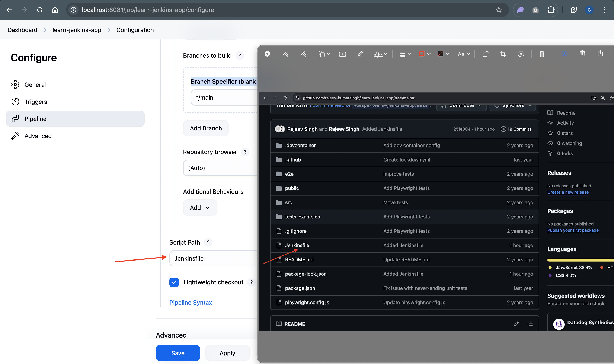
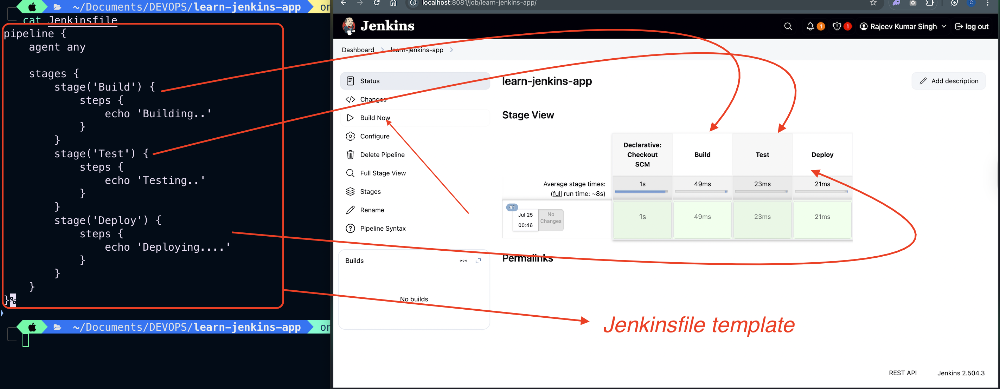

# Steps

1. Create new item

- Give a name
- select pipeline
- click on OK

2. Go to Pipeline Section

- Select SCM(Source Code Management) from definition dropdown menu
  - Select `git` in SCM dropdown
  - Repositories:
    - `Put your Repository URL`
  - Credentials:
    - Required only if you are sharing your private Repository URL
  - Branches to build
    - Branch Specifier (blank for 'any'): `*/main`
    - Add Branch: You can add more branches here which Jenkins can use to fetch latest changes.
  - Script Path: Give name of the Jenkinsfile file which you have created in your GitHub Repo
    
- Click on `Save` Button
- Click on Build Now
  

---

# Console Output

```bash
Started by user Rajeev Kumar Singh

Obtained Jenkinsfile from git https://github.com/rajeev-kumarsingh/learn-jenkins-app.git
[Pipeline] Start of Pipeline
[Pipeline] node
Running on Jenkins
 in /var/jenkins_home/workspace/learn-jenkins-app
[Pipeline] {
[Pipeline] stage
[Pipeline] { (Declarative: Checkout SCM)
[Pipeline] checkout
Selected Git installation does not exist. Using Default
The recommended git tool is: NONE
No credentials specified
Cloning the remote Git repository
Cloning repository https://github.com/rajeev-kumarsingh/learn-jenkins-app.git
 > git init /var/jenkins_home/workspace/learn-jenkins-app # timeout=10
Fetching upstream changes from https://github.com/rajeev-kumarsingh/learn-jenkins-app.git
 > git --version # timeout=10
 > git --version # 'git version 2.39.5'
 > git fetch --tags --force --progress -- https://github.com/rajeev-kumarsingh/learn-jenkins-app.git +refs/heads/*:refs/remotes/origin/* # timeout=10
 > git config remote.origin.url https://github.com/rajeev-kumarsingh/learn-jenkins-app.git # timeout=10
 > git config --add remote.origin.fetch +refs/heads/*:refs/remotes/origin/* # timeout=10
Avoid second fetch
 > git rev-parse refs/remotes/origin/main^{commit} # timeout=10
Checking out Revision 25fe004c47d058d00681fb7de4b11a39269c4aa9 (refs/remotes/origin/main)
 > git config core.sparsecheckout # timeout=10
 > git checkout -f 25fe004c47d058d00681fb7de4b11a39269c4aa9 # timeout=10
Commit message: "Added Jenkinsfile"
First time build. Skipping changelog.
[Pipeline] }
[Pipeline] // stage
[Pipeline] withEnv
[Pipeline] {
[Pipeline] stage
[Pipeline] { (Build)
[Pipeline] echo
Building..
[Pipeline] }
[Pipeline] // stage
[Pipeline] stage
[Pipeline] { (Test)
[Pipeline] echo
Testing..
[Pipeline] }
[Pipeline] // stage
[Pipeline] stage
[Pipeline] { (Deploy)
[Pipeline] echo
Deploying....
[Pipeline] }
[Pipeline] // stage
[Pipeline] }
[Pipeline] // withEnv
[Pipeline] }
[Pipeline] // node
[Pipeline] End of Pipeline
Finished: SUCCESS

```

---

Now, We have to click on `Build now` button on each and every commit. Later on we will automate it to get rid of this manual clicking process.
