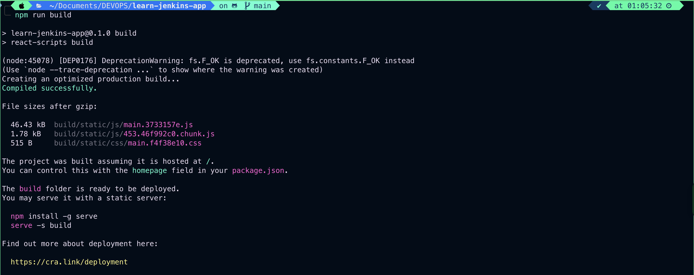
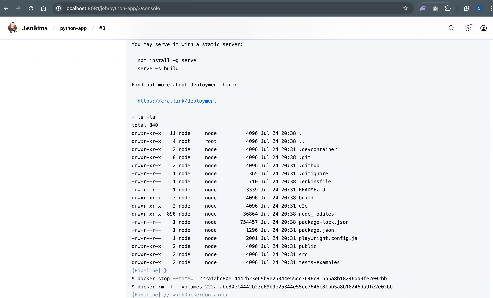
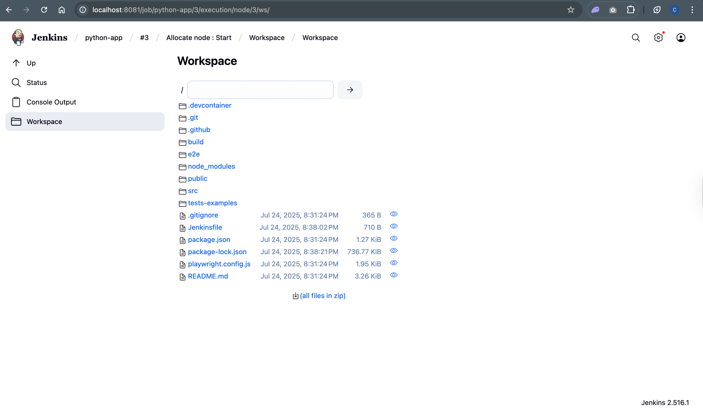

# Building the project

- Every software project requires a build step.
- Some programming languages need to be compiled, but in this case of application, we actually need to create a production build for this web application.
- Now if we're taking a look here at the documentation(README.md file in the project directory), we'll be able to see here that essentially in order to create a production build we need to run the command `npm run build`.
- So let's do this first here locally in this IDE to understand what exactly is happening.

```bash
npm run build
```

The output is as follows:

```bash
> learn-jenkins-app@0.1.0 build
> react-scripts build

(node:45078) [DEP0176] DeprecationWarning: fs.F_OK is deprecated, use fs.constants.F_OK instead
(Use `node --trace-deprecation ...` to show where the warning was created)
Creating an optimized production build...
Compiled successfully.

File sizes after gzip:

  46.43 kB  build/static/js/main.3733157e.js
  1.78 kB   build/static/js/453.46f992c0.chunk.js
  515 B     build/static/css/main.f4f38e10.css

The project was built assuming it is hosted at /.
You can control this with the homepage field in your package.json.

The build folder is ready to be deployed.
You may serve it with a static server:

  npm install -g serve
  serve -s build

Find out more about deployment here:

  https://cra.link/deployment
```



## Verify Build

```bash
ls -ltr
```

The output is as follows:

```bash
total 1512
-rw-r--r--@   1 rajeevsingh  staff    3339 10 Jul 21:31 README.md
-rw-r--r--@   1 rajeevsingh  staff    1296 10 Jul 21:31 package.json
-rw-r--r--@   1 rajeevsingh  staff    2001 10 Jul 21:31 playwright.config.js
drwxr-xr-x@   3 rajeevsingh  staff      96 10 Jul 21:31 tests-examples
drwxr-xr-x@  10 rajeevsingh  staff     320 10 Jul 21:31 src
drwxr-xr-x@   8 rajeevsingh  staff     256 10 Jul 21:31 public
drwxr-xr-x@   3 rajeevsingh  staff      96 10 Jul 21:31 e2e
-rw-r--r--@   1 rajeevsingh  staff  754457 24 Jul 17:31 package-lock.json
drwxr-xr-x@ 891 rajeevsingh  staff   28512 24 Jul 17:54 node_modules
-rw-r--r--@   1 rajeevsingh  staff     357 24 Jul 22:40 Jenkinsfile
drwxr-xr-x@  10 rajeevsingh  staff     320 25 Jul 01:05 build
```

### Check the files inside the build directory

```bash
ls -ltr ./build
```

The output is as follows:

```bash
total 80
-rw-r--r--@ 1 rajeevsingh  staff  3870 25 Jul 01:05 favicon.ico
-rw-r--r--@ 1 rajeevsingh  staff  5347 25 Jul 01:05 logo192.png
-rw-r--r--@ 1 rajeevsingh  staff  9664 25 Jul 01:05 logo512.png
-rw-r--r--@ 1 rajeevsingh  staff   492 25 Jul 01:05 manifest.json
-rw-r--r--@ 1 rajeevsingh  staff    67 25 Jul 01:05 robots.txt
-rw-r--r--@ 1 rajeevsingh  staff   648 25 Jul 01:05 index.html
-rw-r--r--@ 1 rajeevsingh  staff   605 25 Jul 01:05 asset-manifest.json
drwxr-xr-x@ 5 rajeevsingh  staff   160 25 Jul 01:05 static
```

# Now How can we do the same in Jenkins?

- we are jumping into the `Jenkinsfile`
- We need to use Docker beccause we need a docker image that has node installed so that we can run `npm`.
  `Jenkinsfile`

```groovy
pipeline {
    agent any

    stages {
        stage('Build') {
            agent {
                docker {
                    image 'node:18-alpine'
                    reuseNode true
                }
            }
            steps {
                sh '''
                    ls -la
                    node --version
                    npm --version
                    npm install
                    npm run build
                    ls -la
                '''
            }
        }
        stage('Test') {
            steps {
                echo 'Testing..'
            }
        }
        stage('Deploy') {
            steps {
                echo 'Deploying....'
            }
        }
    }
}
```

## Now commit and push to GitHub Repository and then click on `Build now` in Jenkins

The output is as follows


### Verify build directory and nodemodule in workspace


