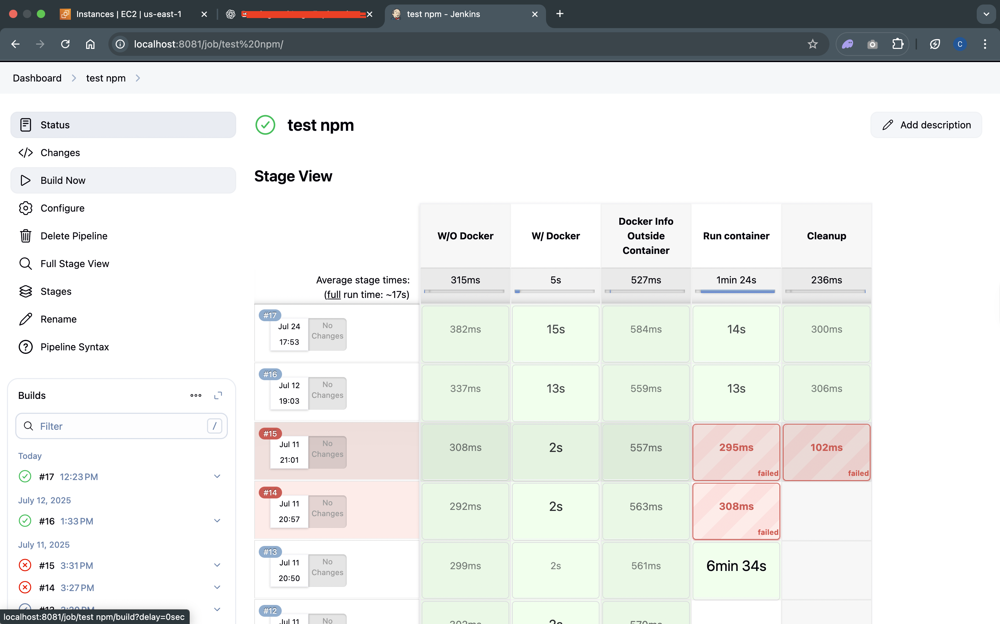
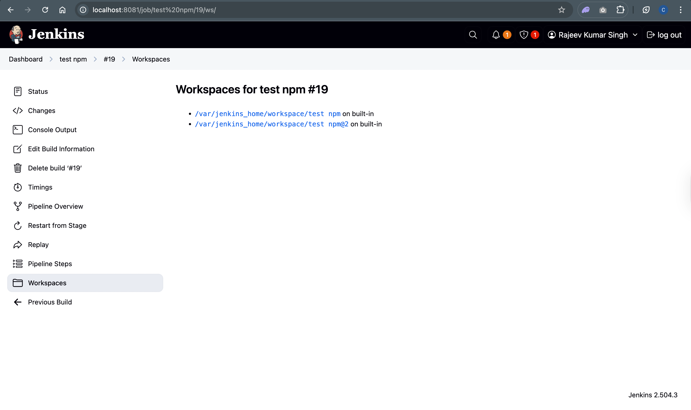
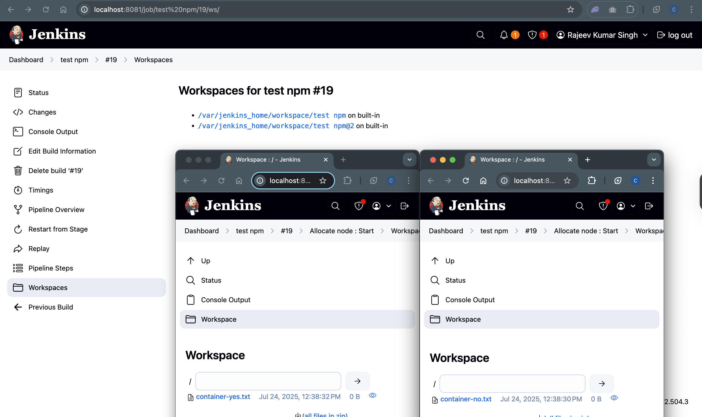
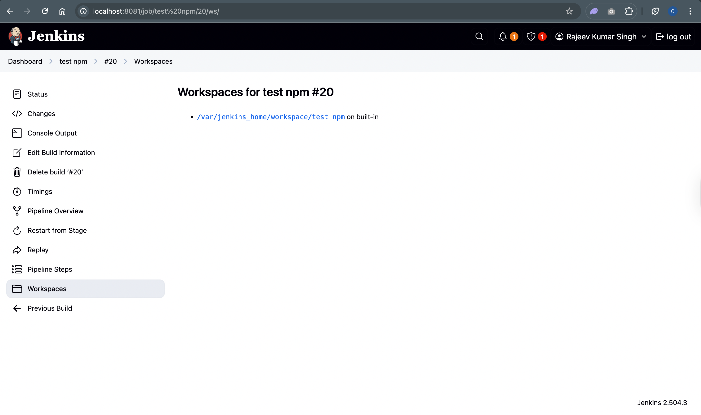
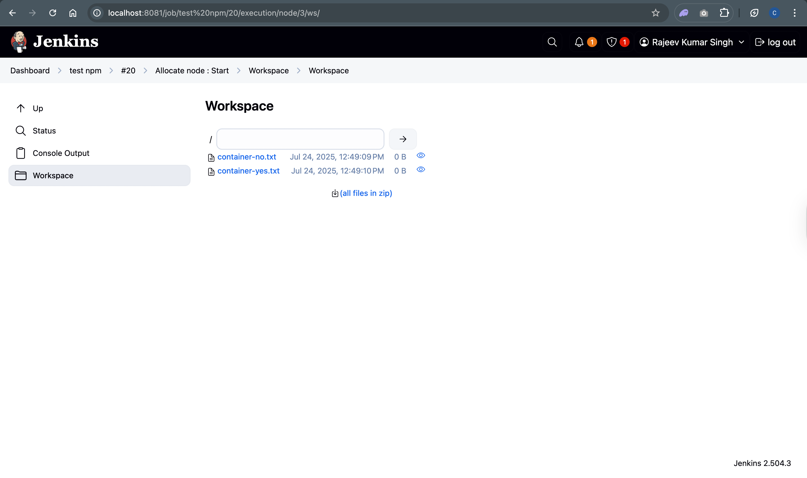

# workspace

## Observe how many workspace are gonna create for with and without docker stages

```groovy
pipeline {
    agent any

    stages {
        stage('W/O Docker') {
            steps {
                sh '''
                    echo "Without Docker"
                    ls -la
                    touch container-no.txt
                   '''

            }
        }

        stage('W/ Docker') {
            agent {
                docker {
                    image 'node:18-alpine'

                }
            }
            steps {
                sh '''
                    echo "With Docker"
                    touch container-yes.txt
                    npm --version

                   '''

            }
        }

        stage('Docker Info Outside Container') {
            steps {
                sh 'docker images'
                sh 'docker ps -a'
            }
        }

        stage('Run container') {
            steps {
                sh 'docker run -d --name nginx-container-1 nginx'
            }
        }

        stage('Cleanup') {
            steps {
                sh 'docker rm -f nginx-container || true'
            }
        }
    }
}

```

### save and build now


click on Build Now, latest build number, workspace to view the workspaces



- So now we have two diffrent workspace but suppose we need only one workspace which can be sharable among all.
- Let's reconfigure our pipeline to achive this:
  Add `reuseNode true` in with Docker stage

```groovy
pipeline {
    agent any

    stages {
        stage('W/O Docker') {
            steps {
                sh '''
                    echo "Without Docker"
                    ls -la
                    touch container-no.txt
                   '''

            }
        }

        stage('W/ Docker') {
            agent {
                docker {
                    image 'node:18-alpine'
                    reuseNode true

                }
            }
            steps {
                sh '''
                    echo "With Docker"
                    touch container-yes.txt
                    npm --version

                   '''

            }
        }

        stage('Docker Info Outside Container') {
            steps {
                sh 'docker images'
                sh 'docker ps -a'
            }
        }

        stage('Run container') {
            steps {
                sh 'docker run -d --name nginx-container-${BUILD_NUMBER} nginx'
            }
        }

        stage('Cleanup') {
            steps {
                sh 'docker rm -f nginx-container || true'
            }
        }
    }
}

```



