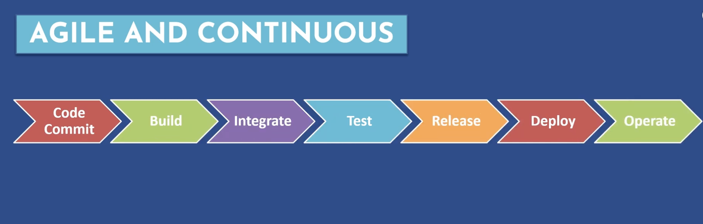
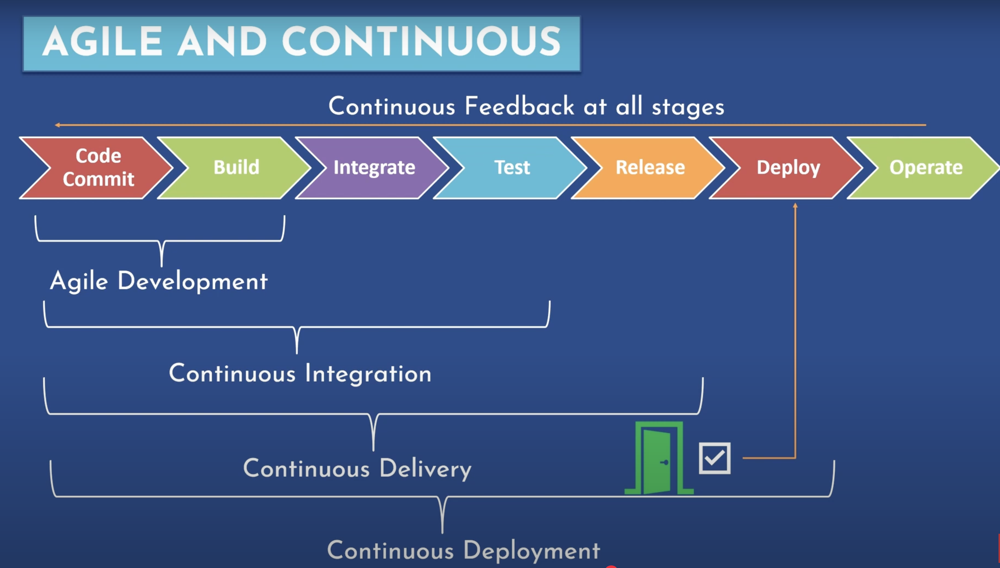
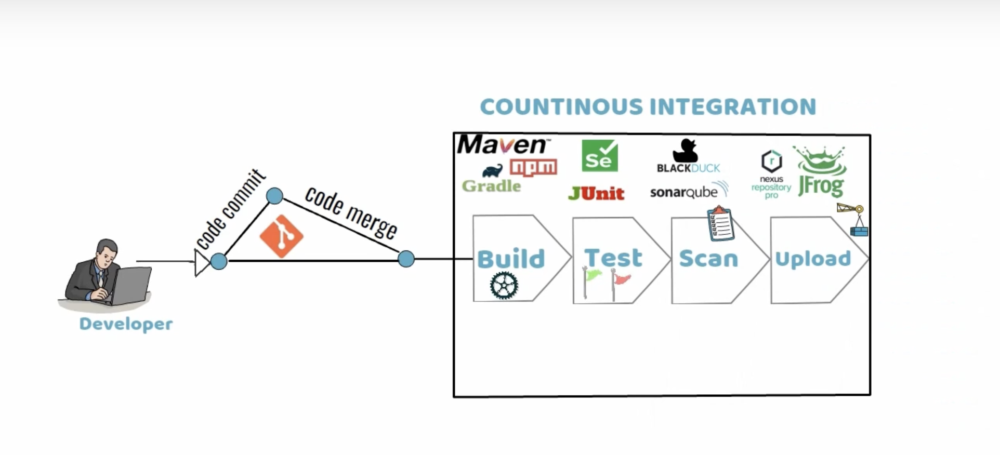
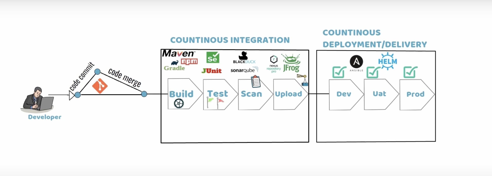
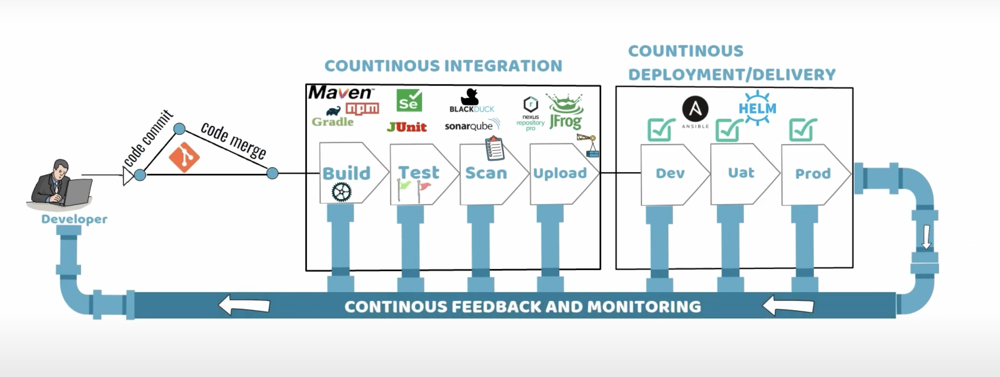
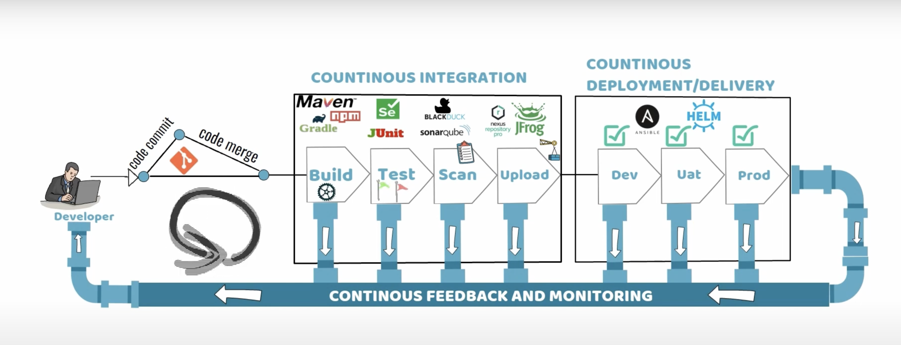

# Problems with the traditional workflows

1. Time consuming
2. Unproductive
3. Changes are costly
4. Lack of transparancy
5. Management Bottlenecks

- In old days, Dev, QA, Ops, Prod Support teams were often siloted.
- In waterfall model large group of developers coded for months.
- Developers handed the complete code to Quality Assurance.
- Quality Assurance ran test and handed bugs back to developers to fix.
- Developers fix the bugs then handed the code back to Quality Assurance, who reran the tests.
- Quality Assurance handed the tested code to Packaging/Deployment.
- Packaging/Deployment released the product.
-
-

# Modern Development Philosophies

1. Collaboration
2. Flexibility in planning and development
3. Shorter Dev Cycles
   
   

---

# Continuous Integration, Delivery and Deployment

## Continuous Integration(CI):

- CI is the frequent, automatic integration of code, All new and modified code is automatically tested with the master code.

## Continuous Delivery:

- CD is the natural extension of CI, It ensure that the code is always ready to be deployed, although manual approval is required to actually deploy the software to the production.

## Continuous Deployment:

- Continuous Deployment automatically deploys all validated changes to production, frequent feedback enables issue to be found and fixed quickly.
- To successfully impliment continuous delivery, it is essential to have a collaborative working relationship with everyone involved. You can then use delivery pipelines, which are automation implimentaion of your product lifecycle.

# Why we need CI/CD?

- Detect bugs and problems in the early stages of SLDC.
- Save cost and efforts.
- Improve the co-ordination between different teams hence, innovative ideas thrives.
- Faster releas to production system.
- Automated testing helps deliver a top-notch quality product.
- Minimum human intervention, hence, less chances of manual errors.

## CloudBees and Jenkins community.

- Jenkins is the most widely used continuous integration and Delivery server.
- `Koshuke Kawaguchi`, one of the founder of CloudBees, created in 2006 as the "Hudson" project. In 2011, the project was renamed to Jenkins.
- Jenkins maintained and supported by independent ans supportive community(`http://www.jenkins.io`) that welcomes new contributors of all technical and experience levels.
- CloudBees partners with Jenkins community for development and maintenance tasks.
- CloudBees engineers contribute significantly with Jenkins project, co-ordinate with the community on releases, and contribute fixes back to the community.
-
-

# Jenkins Workflows

# Jenkins Workflows (Pipelines)

Jenkins workflows, also known as **Jenkins Pipelines**, are a way to define and automate CI/CD processes using code. Jenkins provides two types of pipeline syntax:

1. **Declarative Pipeline** – A structured, easier-to-read syntax with a `pipeline {}` block.
2. **Scripted Pipeline** – A more flexible but complex Groovy-based approach using a `node {}` block.

---

## **Basic Jenkins Pipeline Example**

### **Declarative Pipeline**

```groovy
pipeline {
    agent any
    stages {
        stage('Build') {
            steps {
                echo 'Building...'
            }
        }
        stage('Test') {
            steps {
                echo 'Testing...'
            }
        }
        stage('Deploy') {
            steps {
                echo 'Deploying...'
            }
        }
    }
}
```

---

## **Advanced Jenkins Pipeline Features**

### **1. Parallel Stages**

```groovy
pipeline {
    agent any
    stages {
        stage('Parallel Stages') {
            parallel {
                stage('Unit Tests') {
                    steps {
                        echo 'Running unit tests...'
                    }
                }
                stage('Integration Tests') {
                    steps {
                        echo 'Running integration tests...'
                    }
                }
            }
        }
    }
}
```

### **2. Using Environment Variables**

```groovy
pipeline {
    agent any
    environment {
        APP_ENV = 'staging'
    }
    stages {
        stage('Deploy') {
            steps {
                echo "Deploying to ${APP_ENV} environment"
            }
        }
    }
}
```

### **3. Conditional Execution**

```groovy
pipeline {
    agent any
    stages {
        stage('Deploy') {
            when {
                branch 'main'
            }
            steps {
                echo 'Deploying to production...'
            }
        }
    }
}
```

### **4. Using Credentials**

```groovy
pipeline {
    agent any
    environment {
        AWS_ACCESS_KEY_ID = credentials('aws-access-key')
    }
    stages {
        stage('Deploy to AWS') {
            steps {
                sh 'aws s3 sync ./build s3://my-bucket/'
            }
        }
    }
}
```

---

## **Scripted Pipeline Example**

```groovy
node {
    stage('Checkout') {
        checkout scm
    }
    stage('Build') {
        sh 'mvn clean package'
    }
    stage('Test') {
        sh 'mvn test'
    }
    stage('Deploy') {
        sh 'scp target/my-app.jar user@server:/deploy/'
    }
}
```






- ***

-
-
-
-
-
-
-
-
-
-
-
- ***

-
-
-
-
-
-
-
-
-
-
-
- ***

-
-
-
-
-
-
-
-
-
-
-
- ***

-
-
-
-
-
-
-
-
-
-
-
- ***

-
-
-
-
-
-
-
-
-
-
-
- ***

-
-
-
-
-
-
-
-
-
-
-
- ***

-
-
-
-
-
-
-
-
-
-
-
- ***

-
-
-
-
-
-
-
-
-
-
-
- ***

-
-
-
-
-
-
-
-
-
-
-
- ***

-
-
-
-
-
-
-
-
-
-
-
- ***

-
-
-
-
-
-
-
-
-
-
-
- ***

-
-
-
-
-
-
-
-
-
-
-
- ***

-
-
-
-
-
-
-
-
-
-
-
- ***

-
-
-
-
-
-
-
-
-
-
-
- ***

-
-
-
-
-
-
-
-
-
-
-
- ***

-
-
-
-
-
-
-
-
-
-
-
- ***

-
-
-
-
-
-
-
-
-
-
-
- ***

-
-
-
-
-
-
-
-
-
-
-
- ***

-
-
-
-
-
-
-
-
-
-
-
- ***

-
-
-
-
-
-
-
-
-
-
-
- ***

-
-
-
-
-
-
-
-
-
-
-
- ***

-
-
-
-
-
-
-
-
-
-
-
- ***

-
-
-
-
-
-
-
-
-
-
-
- ***

-
-
-
-
-
-
-
-
-
-
-
- ***

-
-
-
-
-
-
-
-
-
-
-
-
-
-
